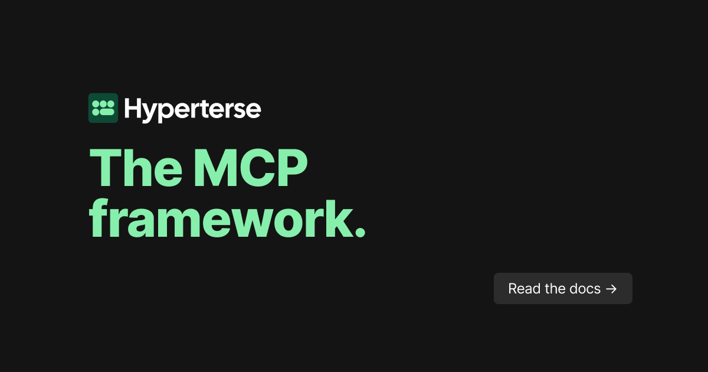

<div align="center">
  <picture>
    
  </picture>
</div>
<br />
<div align="center">
  <h1>Hyperterse</h1>
</div>
<p align="center">
  <strong>The declarative framework for performant MCP servers.</strong><br />
  <a href="https://hyperterse.com">Website</a>
  •
  <a href="https://docs.hyperterse.com">Documentation</a>
  •
  <a href="#quick-start">Quick Start</a>
  •
  <a href="#tool-examples">Examples</a>
  •
  <a href="https://github.com/hyperterse/hyperterse">GitHub</a>
</p>

---

Hyperterse turns tool configs into callable tools, with:

- filesystem-based tool discovery,
- pluggable adapters (Postgres, MySQL, MongoDB, Redis),
- optional scripts for transforms and handlers,
- MCP runtime exposure over Streamable HTTP.

## What Hyperterse is

- **Tool-first MCP framework**: each tool config compiles into a tool.
- **Declarative runtime**: root config + adapter files + tool files.
- **Extensible execution pipeline**: auth -> input transform -> execute -> output transform.
- **Embedded scripting**: script hooks run in a sandboxed runtime; bundled at compile time.

## Quick start

### Install

```bash
curl -fsSL https://hyperterse.com/install | bash
```

### Initialize

```bash
hyperterse init
```

This scaffolds:

- `.hyperterse`
- `app/adapters/my-database.terse`
- `app/tools/hello-world/config.terse`
- `app/tools/hello-world/user-data-mapper.ts`

### Run

```bash
hyperterse start
```

With hot reload:

```bash
hyperterse start --watch
```

### Test

```bash
curl http://localhost:8080/heartbeat
```

```bash
curl -X POST http://localhost:8080/mcp \
  -H "Content-Type: application/json" \
  -d '{
    "jsonrpc": "2.0",
    "method": "tools/list",
    "id": 1
  }'
```

## Project structure

```text
my-project/
  .hyperterse
  app/
    adapters/
      main-db.terse
    tools/
      get-user/
        config.terse
        input.ts
        output.ts
      get-weather/
        config.terse
        handler.ts
```

## Tool examples

### DB-backed tool

```yaml
description: "Get user by id"
use: main-db
statement: |
  SELECT id, name, email
  FROM users
  WHERE id = {{ inputs.user_id }}
inputs:
  user_id:
    type: int
```

### Script-backed tool

```yaml
description: "Get weather"
handler: "./weather-handler.ts"
```

## CLI commands

- `start` - run runtime from config
- `serve` - run from a compiled artifact
- `build` - produce a deployable artifact
- `validate` - validate config and tool scripts
- `init` - scaffold starter project
- `upgrade` - upgrade installed binary
- `completion` - shell completion helper

## Build and deploy

```bash
hyperterse validate
hyperterse build -o dist
hyperterse serve dist/
```

The `dist/` output includes everything needed to run in production.

## Configuration highlights

- root config: `.hyperterse`
- adapter files: `app/adapters/*.terse`
- tool files: `app/tools/*/config.terse`

Supported primitive types:

- `string`
- `int`
- `float`
- `boolean`
- `datetime`

## Security note

Hyperterse validates typed inputs, but statement placeholder substitution (`{{ inputs.x }}`) is raw string replacement. Use strict tool input constraints and safe query patterns for production.

## Contributing

1. Fork the repo
2. Create a feature branch
3. Add or update tests
4. Run validation/lint/test locally
5. Open a PR

See `CONTRIBUTING.md` and `CODE_OF_CONDUCT.md`.

---

<p align="center">
  The declarative framework for performant MCP servers.<br />
  <a href="https://hyperterse.com">Website</a>
  •
  <a href="https://github.com/hyperterse/hyperterse">GitHub</a>
  •
  <a href="https://docs.hyperterse.com">Documentation</a>
</p>
