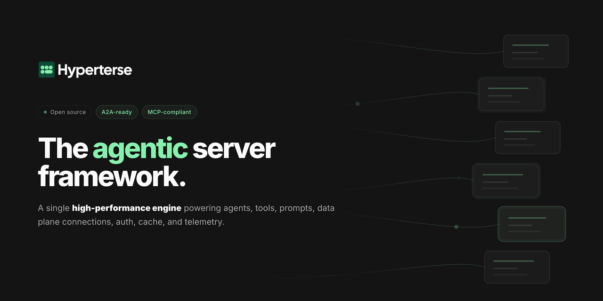

<!-- Start of - Dont change this block -->
<div align="center">
  <picture>
    
  </picture>
</div>
<br />
<div align="center">
  <h1>Hyperterse</h1>
</div>
<p align="center">
  <strong>The declarative framework for performant MCP servers.</strong><br />
  <a href="https://hyperterse.com">Website</a>
  •
  <a href="https://docs.hyperterse.com">Documentation</a>
  •
  <a href="#quick-start">Quick Start</a>
  •
  <a href="#tool-examples">Examples</a>
  •
  <a href="https://github.com/hyperterse/hyperterse">GitHub</a>
</p>

---

<!-- End of - Dont change this block -->

Hyperterse is a **tool-first MCP framework** for building AI-ready backend surfaces from declarative config.

You define tools and adapters in the filesystem, and Hyperterse handles compile-time validation, script bundling, runtime execution, auth, caching, and observability.

## What Hyperterse is for

- Exposing database queries and custom logic as MCP tools
- Running a production MCP server over Streamable HTTP
- Keeping tool definitions declarative while still supporting TypeScript handlers/transforms

## Core capabilities

- **Filesystem discovery**: each `app/tools/*/config.terse` becomes one project tool.
- **Execution models**: DB-backed tools (`use` + `statement`) or script-backed tools (`handler`).
- **Database adapters**: PostgreSQL, MySQL, MongoDB, Redis.
- **Per-tool auth**: built-in `allow_all` and `api_key`, plus custom plugins.
- **In-memory caching**: global defaults + per-tool overrides.
- **Observability**: OpenTelemetry tracing/metrics + structured logging.

## Quick Start

### Install

```bash
curl -fsSL https://hyperterse.com/install | bash
```

### Initialize

```bash
hyperterse init
```

Generated starter structure:

```text
.
├── .hyperterse
├── .agent/
│   └── skills/
│       └── hyperterse-docs/
│           └── SKILL.md
└── app/
    └── tools/
        └── hello-world/
            ├── config.terse
            └── handler.ts
```

### Start

```bash
hyperterse start
```

With live reload:

```bash
hyperterse start --watch
```

### Verify health

```bash
curl http://localhost:8080/heartbeat
```

Expected response:

```json
{ "success": true }
```

### 5) List MCP entry tools

```bash
curl -s -X POST http://localhost:8080/mcp \
  -H "Content-Type: application/json" \
  -d '{
    "jsonrpc": "2.0",
    "method": "tools/list",
    "id": 1
  }' | jq
```

By design, Hyperterse exposes two transport-layer tools:

- `search` - discover project tools by natural language
- `execute` - execute a project tool by name

### 6) Discover project tools

```bash
curl -s -X POST http://localhost:8080/mcp \
  -H "Content-Type: application/json" \
  -d '{
    "jsonrpc": "2.0",
    "method": "tools/call",
    "params": {
      "name": "search",
      "arguments": {
        "query": "hello world greeting"
      }
    },
    "id": 2
  }' | jq
```

Search hits include `name`, `description`, `relevance_score`, and `inputs`.

### Execute a project tool

```bash
curl -s -X POST http://localhost:8080/mcp \
  -H "Content-Type: application/json" \
  -d '{
    "jsonrpc": "2.0",
    "method": "tools/call",
    "params": {
      "name": "execute",
      "arguments": {
        "tool": "hello-world",
        "inputs": { "name": "Hyperterse" }
      }
    },
    "id": 3
  }' | jq
```

### Validate and build

```bash
hyperterse validate
hyperterse build -o dist
hyperterse serve dist/
```

## Configuration model

### Project layout

```text
my-project/
├── .hyperterse
├── app/
│   ├── adapters/
│   │   └── primary-db.terse
│   └── tools/
│       ├── get-user/
│       │   ├── config.terse
│       │   ├── input.ts
│       │   └── output.ts
│       └── get-weather/
│           ├── config.terse
│           └── handler.ts
└── package.json
```

### Root config (`.hyperterse`)

```yaml
name: my-service
server:
  port: 8080
  log_level: 3
tools:
  search:
    limit: 10
  cache:
    enabled: true
    ttl: 60
```

## Tool Examples

### DB-backed tool

```yaml
description: "Get user by ID"
use: primary-db
statement: |
  SELECT id, name, email
  FROM users
  WHERE id = {{ inputs.user_id }}
inputs:
  user_id:
    type: int
auth:
  plugin: api_key
  policy:
    value: "{{ env.API_KEY }}"
```

### Script-backed tool

```yaml
description: "Get weather by city"
handler: "./handler.ts"
inputs:
  city:
    type: string
auth:
  plugin: allow_all
```

Supported input types:

- `string`
- `int`
- `float`
- `boolean`
- `datetime`

Each tool must define exactly one execution mode:

- `use` (adapter-backed), or
- `handler` (script-backed)

## Runtime model

All tool interaction happens through MCP Streamable HTTP at `/mcp` (JSON-RPC 2.0).

Execution pipeline:

1. Tool resolution
2. Authentication
3. Input transform (optional)
4. Execution (DB or handler)
5. Output transform (optional)
6. Response serialization

## Security notes

- Use `{{ env.VAR_NAME }}` for secrets and connection strings.
- `{{ inputs.field }}` statement substitution is textual; enforce strict input schemas and safe query patterns.
- Configure tool-level auth explicitly for production use.

## Documentation map

- [Documentation index (`llms.txt`)](https://docs.hyperterse.com/llms.txt)
- [Introduction](https://docs.hyperterse.com/introduction)
- [Quickstart](https://docs.hyperterse.com/quickstart)
- [Project structure](https://docs.hyperterse.com/concepts/project-structure)
- [Tools](https://docs.hyperterse.com/concepts/tools)
- [Adapters](https://docs.hyperterse.com/concepts/adapters)
- [Scripts](https://docs.hyperterse.com/concepts/scripts)
- [MCP transport](https://docs.hyperterse.com/runtime/mcp-transport)
- [Execution pipeline](https://docs.hyperterse.com/runtime/execution-pipeline)
- [CLI reference](https://docs.hyperterse.com/reference/cli)
- [Configuration schemas](https://docs.hyperterse.com/reference/configuration-schemas)

## Contributing

1. Fork the repo.
2. Create a feature branch.
3. Add or update tests.
4. Run validation locally.
5. Open a PR.

See `CONTRIBUTING.md` and `CODE_OF_CONDUCT.md`.

---

<p align="center">
  The declarative framework for performant MCP servers.<br />
  <a href="https://hyperterse.com">Website</a>
  •
  <a href="https://github.com/hyperterse/hyperterse">GitHub</a>
  •
  <a href="https://docs.hyperterse.com">Documentation</a>
</p>
